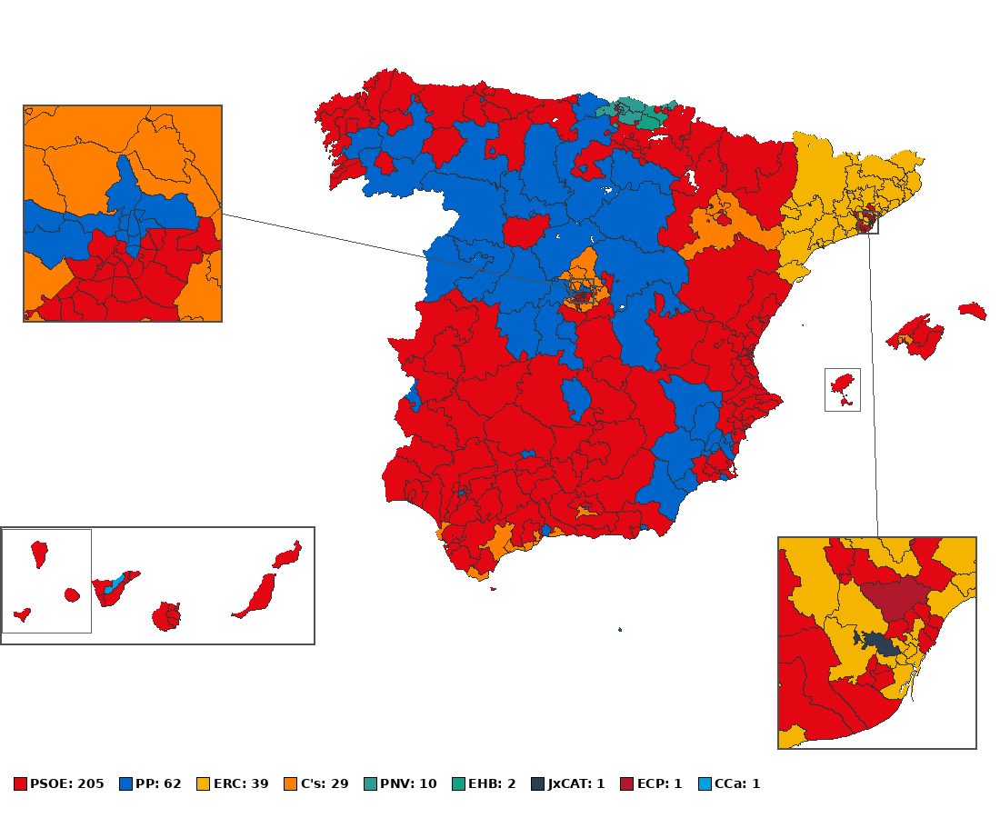

# Spanish General Elections Simulator — First-Past-The-Post

Simulates Spanish general elections using first-past-the-post (uninominales) districts with official INE data.



*Simulated result of the April 2019 election — 35 constituencies, 350 seats*

## Quick Start

```bash
# 1. Create a virtual environment (once)
python3 -m venv env
source env/bin/activate

# 2. Install dependencies
pip install -r requirements.txt

# 3. Run complete workflow (parse data + simulate + generate map)
python3 run.py

# Or specify a year
python3 run.py --year 2015
```

### Available years

| Year | Flag | Notes |
|------|------|-------|
| 2008 | `--year 2008` | |
| 2011 | `--year 2011` | |
| 2015 | `--year 2015` | Default |
| 2016 | `--year 2016` | |
| 2019 (April) | `--year 2019a` | |
| 2019 (November) | `--year 2019b` | |

### Workflow options

```bash
# Skip map rendering (generate shapefile only)
python3 run.py --skip-map

# Don't generate shapefile (print results only)
python3 run.py --no-map

# Just render the map from an existing shapefile (fast)
python3 run.py --viz-only

# Simulation method: 'transfer' (two-round with vote transfer) or
# 'plurality' (simple FPTP, no transfers). Default: transfer
python3 run.py --method plurality

# Customize map dimensions
python3 run.py --width 1200 --height 1000
```

## Downloading election data

1. Go to the [INE Electoral Data Download](https://infoelectoral.interior.gob.es/es/elecciones-celebradas/area-de-descargas/)
2. Select: Ambito → Mesa, Tipo → Candidatura
3. Choose the year and download the ZIP
4. Extract the `.DAT` file to `data/raw/YYYY/` (e.g. `data/raw/2015/`)

## Project Structure

```
uninominales/
├── run.py                    # Main orchestrator script
├── src/                      # Source modules
│   ├── dat_parser.py         # INE DAT file parser
│   ├── party_parser.py       # Party transfer file parser (YAML)
│   ├── constituency_parser.py # Constituency definition parser
│   ├── simulation.py         # FPTP vote transfer simulation
│   ├── election_runner.py    # Simulation orchestrator
│   ├── shapefile_gen.py      # Shapefile generator
│   └── visualization/        # Map renderer (package)
│       ├── core.py           # Core drawing utilities
│       ├── config.py         # Party colors and constants
│       ├── canarias.py       # Canary Islands relocation
│       ├── insets.py         # Madrid / Barcelona inset maps
│       └── connections.py    # Island connection boxes
├── data/
│   ├── raw/                  # INE election DAT files (untracked, ~25 MB each)
│   ├── circunscripciones/    # 52 province constituency definitions
│   ├── partidos/             # Party YAML files
│   │   ├── parties.yaml      # Central party names and colors
│   │   ├── 2008/             # Per-region files for 2008
│   │   ├── 2011/             # Per-region files for 2011
│   │   ├── 2015/             # Per-region files for 2015
│   │   ├── 2016/             # Per-region files for 2016
│   │   ├── 2019a/            # Per-region files for April 2019
│   │   └── 2019b/            # Per-region files for November 2019
│   ├── regions.dat           # Province code → region name mapping
│   └── mapas/molde/          # Template census-section shapefile
├── output/                   # Generated shapefiles and PNG maps
├── images/                   # README images
├── tests/                    # Test suite
│   ├── golden/               # Golden reference PNG images
│   └── test_*.py             # Unit and regression tests
├── requirements.txt          # Python dependencies
├── LICENSE                   # MIT License
└── README.md
```

## How it works

1. **Data Parsing** (`src/dat_parser.py`) — Parses INE fixed-width DAT files (candidatura data per census section), aggregates votes by census section and party.

2. **Simulation** (`src/simulation.py` + `src/election_runner.py`) — For each of the 52 provinces, collects all party votes, applies transfer rules (eliminated parties' votes flow to others), and the party with the most votes wins the seat. The special party `R` (resto) collects minor/unknown candidaturas and is always redistributed.

3. **Shapefile Generation** (`src/shapefile_gen.py`) — Reads a template census-section shapefile, adds constituency and winning party columns, saves to `output/mapa{YEAR}.shp`.

4. **Visualization** (`src/visualization/`) — Renders the shapefile to a PNG with Canary Islands relocation, Madrid/Barcelona inset maps, and party-colored constituencies with legend.

## Testing

```bash
# Fast tests (unit + regression)
pytest

# Slow tests (golden PNG comparison, ~2 min)
pytest --runslow

# Regenerate golden images after intentional changes
pytest --regenerate-golden
```

## AI assistance

This project was originally written by Landertxu and later rewritten with the assistance of AI.

## License

MIT
